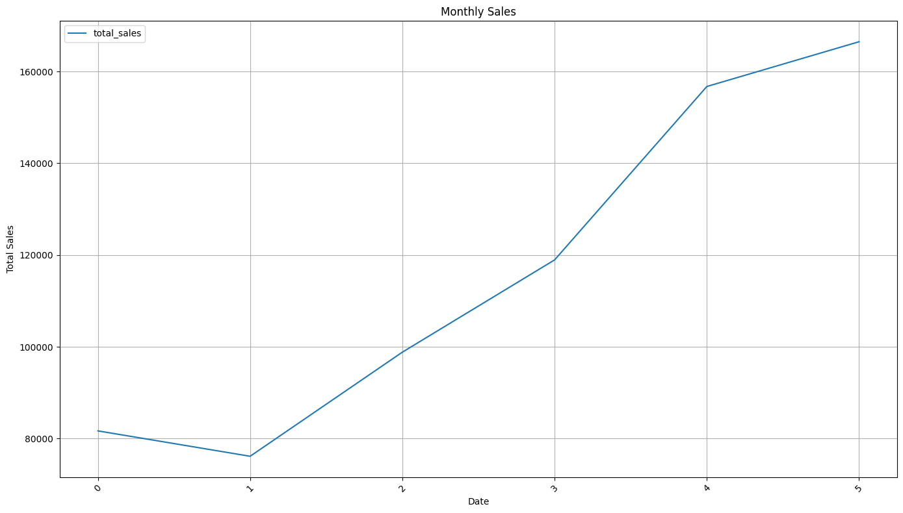
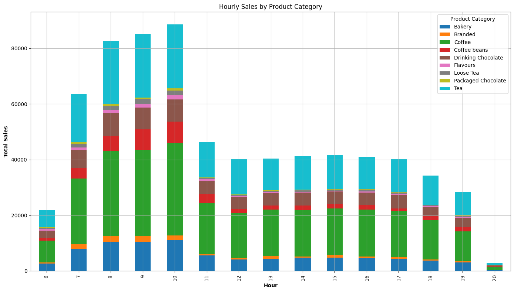
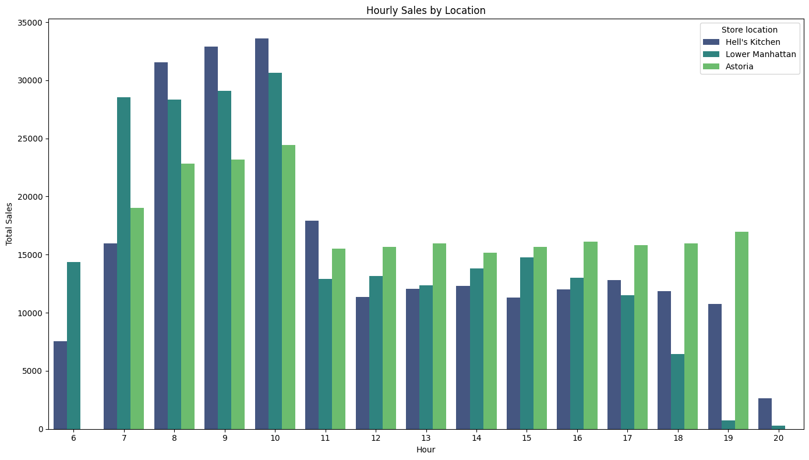

# Coffee Shop Sales: Exploratory Data Analysis

## Executive Summary

This project explores six months of transaction data, a coffee shop chain with three locations in New York City. Using Python for data cleaning, aggregation and visualization, the analysis looks at how revenue moved over time, when the stores are busiest during the day, and which product categories actually carry the business. The goal here is descriptive: the notebook does not build a forecasting or classification model, it turns a raw transaction log into a set of patterns that a store manager could act on.

## Business Problem

Questions that matter for day to day operations: 
- When to schedule extra staff?
- Do all three locations behave the same way?
- How have coffee shop's sales trended over time?
- Which days of the week tend to be busiest, and why do you think that's the case?
- What times of day tend to be most popular? Does the same trend hold across all locations?
- Which products are sold most and least often? Which drive the most revenue for the business?
This project treats the dataset as if it belonged to an owner who wants a clear, evidence based picture of sales patterns before making decisions about staffing and inventory.

## Dataset

The data comes from the Coffee Shop Sales dataset published by Maven Analytics (Maven Roasters, a fictional coffee shop chain with three locations in New York City: Astoria, Hell's Kitchen and Lower Manhattan). It is released under a public domain license.

The file is not included in this repository because of its size. Download it from the Maven Analytics Data Playground (https://mavenanalytics.io/data-playground/coffee-shop-sales), save it as `Coffee Shop Sales.xlsx` and place it in the project's root folder, or update the path inside the notebook.

The dataset holds 149,116 transactions recorded between January 1 and June 30, 2023, described by 11 columns: transaction id, date, time, quantity, store id, store location, product id, unit price, product category, product type and product detail. No missing values appear in any column.

## Project Workflow

```
Load the dataset
    ↓
Check data types and missing values
    ↓
Engineer date, time and revenue fields
    ↓
Aggregate sales by location, month, weekday and hour
    ↓
Visualize revenue trends and hourly patterns
    ↓
Summarize findings and recommendations
```

## Exploratory Data Analysis

Before the plots below, it helps to note the scale of the business as a whole. Over the six months covered by the dataset, the three stores generated a combined $698,812 in revenue from 149,116 transactions, an average ticket of about $4.69. Revenue also split almost evenly across locations: Astoria brought in $232,243.91, Hell's Kitchen $236,511.17 and Lower Manhattan $230,057.25, a spread of under three percent between the highest and lowest performer. Day of week turned out to carry little signal either, total sales range only from $96,894 on Saturday to $101,677 on Monday, so no separate chart is included for that comparison. It simply is not where the story of this dataset lives.

### Revenue Growth Across the Period



Monthly revenue is where the clearest trend in the dataset shows up. Sales opened the year at $81,677.74. Revenue in June is more than double what it was in February. Part of this is likely seasonal, warmer weather tends to bring more foot traffic and more demand for cold drinks, but six months is not enough data to separate a seasonal effect from an underlying growth trend with any real confidence.

### Peak Hours and the Product Mix



Sales by hour tell a much sharper story than sales by day of week. Activity rises quickly to a clear peak between 7 and 10 am, when Coffee alone accounts for roughly half of hourly revenue. Tea follows a broadly similar hourly shape to Coffee.

### Store Performance Throughout the Day



Splitting the hourly pattern by location shows that the morning rush is shared by all three stores, but the rest of the day is not identical across them. Hell's Kitchen and Lower Manhattan both taper off steadily after the morning peak, and Lower Manhattan in particular falls close to zero after 7 pm. Astoria behaves differently: its curve stays flatter through the afternoon and evening, and its sales at 7 pm are close to its highest point of the day. Astoria also shows no recorded transactions at 6 am, suggesting it opens later than the other two locations.

## Business Insights & Recommendations

* Revenue nearly doubled between February and June, and the growth held across all three locations, so whatever is driving it is not tied to a single store.
* Roughly a third of daily revenue is generated inside a narrow morning window of about 7 to 10 am, and this holds in every store. Staffing built around this window, rather than spread evenly across opening hours, would match demand more closely than an even schedule.
* Astoria does not follow the evening decline seen at the other two locations. Its later opening time and steadier evening traffic mean its schedule probably should not simply mirror Hell's Kitchen or Lower Manhattan.
* Day of week has almost no measurable effect on total revenue, so promotions aimed at boosting a particular slow day are unlikely to move much. The hour of the day matters far more than which day it falls on.

## Built With

* Python
* Pandas
* Matplotlib
* Seaborn
* openpyxl (for reading the Excel source file)

## How to Run the Project

Clone the repository:

```
git clone https://github.com/nkorlov-data/Coffee-Sales-EDA.git
```

Navigate into the project folder:

```
cd Coffee-Sales-EDA
```

Install the required packages:

```
pip install pandas matplotlib seaborn openpyxl
```

Run the notebook (after placing `Coffee Shop Sales.xlsx` in the project folder):

```
jupyter notebook Coffee_Sales_Analysis.ipynb
```

## Future Improvements

* Compare best selling product types within each location individually rather than only at the category level.
* Turn the descriptive patterns above into a short term demand forecast for staffing purposes.
